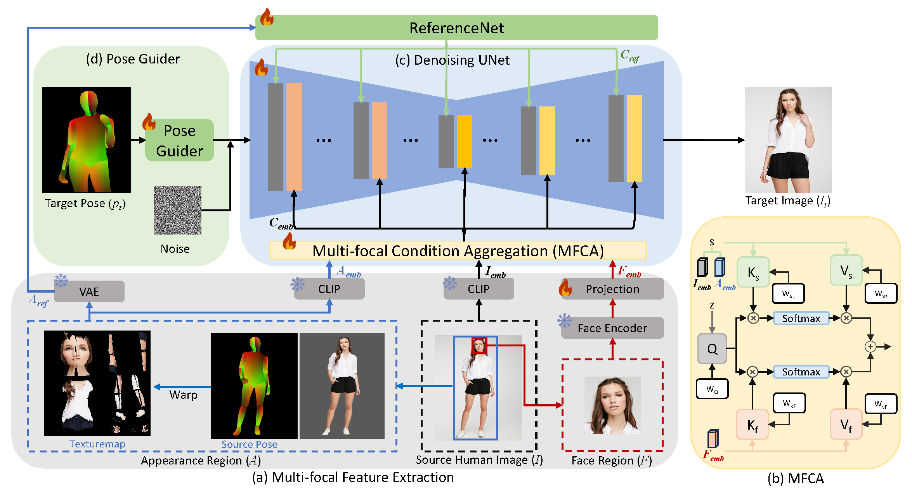

# MCLD [](https://arxiv.org/abs/2402.18078)

> **Multi-focal Conditioned Latent Diffusion for Person Image Synthesis** <br>
> _Jiaqi Liu, Jichao Zhang, Paolo Rota, Nicu Sebe_<br>
> _Computer Vision and Pattern Recognition Conference (**CVPR**), 2025, Nashville, USA_


## Generated Results
   You can directly download our test results from [Google Drive](https://drive.google.com/drive/folders/1XweWnWqyey9Cp9Cyq_nUEyAyAM8PBaNA?usp=drive_link) (Including 256x176, 512*352 on Deepfashion) for further comparison.

## Dataset

- Download `img_highres.zip` of the DeepFashion Dataset from [In-shop Clothes Retrieval Benchmark](https://drive.google.com/drive/folders/0B7EVK8r0v71pYkd5TzBiclMzR00). 

- Unzip `img_highres.zip`. You will need to ask for password from the [dataset maintainers](http://mmlab.ie.cuhk.edu.hk/projects/DeepFashion/InShopRetrieval.html). Then unzip it and put it under the `./dataset/deepfashion` directory. 

- Preprocess dataset by runing `prepare_dataset.py`. This will split the dataset, and prepare the needed conditions such poses, texture maps and face embeddings. You need pip install [detectron2](https://detectron2.readthedocs.io/en/latest/tutorials/install.html) for Densepose. The whole preprocessing time requires ~ 8h. You could also download our processed conditions form [Google Drive](https://drive.google.com/drive/folders/1U5e1eL02b6KIm67LSnHqTjecA7MN57ag?usp=drive_link) and unzip. 

- After the preprocessing, you should have your dataset folder organized as follows:

```text
./dataset/fashion/
|-- train
|-- train_densepose
|-- train_texture
|-- train_face
|-- test
|-- test_densepose
|-- test_texture
|-- test_face
|-- MEN
|-- WOMEN
```

## Preparation

### Install Environment

```
conda env create -f environment.yaml
```
### Download pretrained Models

1. Download pretrained weight of based models and other components and put it to the pretrained weights: 
    - [StableDiffusion V1.5](https://huggingface.co/stable-diffusion-v1-5/stable-diffusion-v1-5)
    - [sd-vae-ft-mse](https://huggingface.co/stabilityai/sd-vae-ft-mse)
    - [image_encoder](https://huggingface.co/lambdalabs/sd-image-variations-diffusers/tree/main/image_encoder)
    - [pose_guder](https://huggingface.co/lllyasviel/sd-controlnet-seg)
    - [densepose_model](https://dl.fbaipublicfiles.com/densepose/densepose_rcnn_R_101_FPN_DL_s1x/165712116/model_final_844d15.pkl)

2. Download our trained checkpoints from [Google drive](https://drive.google.com/drive/folders/18643_1GmWWLcKCruKqrfHaecejy-U93x?usp=drive_link) and put it to `./checkpoints` folder.

Finally you will have your pretrained weight as this structure:

```text
./pretrained_weights/
model_final_844d15.pkl
|-- control_v11p_sd15_seg
    |-- config.json
    |-- diffusion_pytorch_model.bin
    `-- diffusion_pytorch_model.safetensors
|-- image_encoder
|   |-- config.json
|   `-- pytorch_model.bin
|-- sd-vae-ft-mse
|   |-- config.json
|   |-- diffusion_pytorch_model.bin
|   `-- diffusion_pytorch_model.safetensors
`-- stable-diffusion-v1-5
    |-- feature_extractor
    |   `-- preprocessor_config.json
    |-- model_index.json
    |-- unet
    |   |-- config.json
    |   `-- diffusion_pytorch_model.bin
    `-- v1-inference.yaml
./checkpoints/
|-- denoising_unet.pth
|-- image_projector.pth
|-- pose_guider.pth
`-- reference_unet.pth
```


## Method 


The overall pipeline of our proposed Multi-focal Conditioned Diffusion Model. (a) Face regions and appearance regions are first extracted from the source person images; (b) multi-focal condition aggregation module $\phi$ is used to fuse the focal embeddings as $c_{emb}$; (c) ReferenceNet $\mathcal{R}$ is used to aggregate information from the appearance texture map, denoted as $c_{ref}$; (d) Densepose provides the pose control to be fused into UNet with noise by Pose Guider. 


## Training

This code support multi-GPU training with `accelerate`. Full training takes `~26 hours` with 2 A100-80G GPUs with a batch size 12 on deepfashion dataset. 

```bash
accelerate launch --main_process_port 12148 train.py --config ./configs/train/train.yaml
```

## Validation 
To test our method on the whole Deepfashion dataset, run:

``` bash
test.py --save_path FOLDER_TO_SAVE --ckpt_dir ./checkpoints/ --config_path ./configs/train/train.yaml
```

Then, the results can be evaluated by:

``` bash
evaluate.py --save_path FOLDER_TO_SAVE --gt_folder FOLDER_FOR_GT --training_path ./dataset/fashion/train/
```

## Editing

MCLD allows flexible editing since it decompose the human appearance and identities. We will release the editing code in the future as soon as it ready.


## Citation